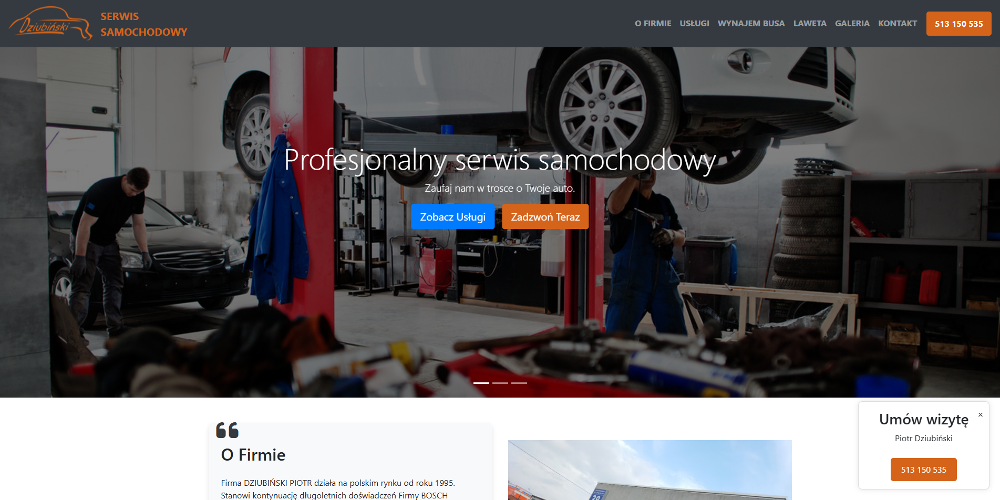
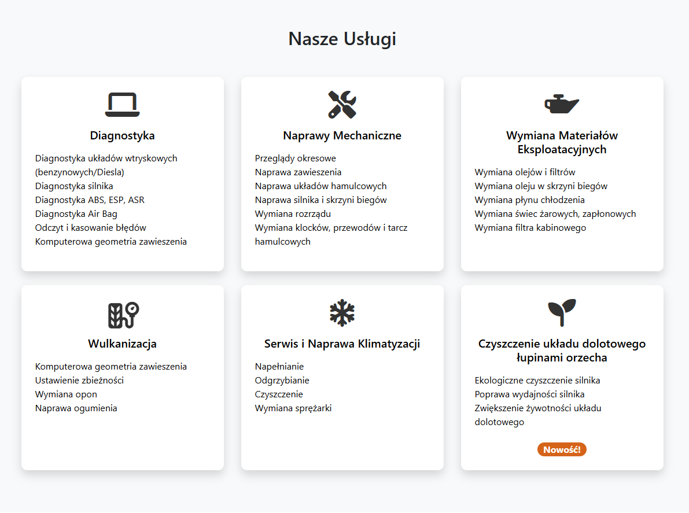
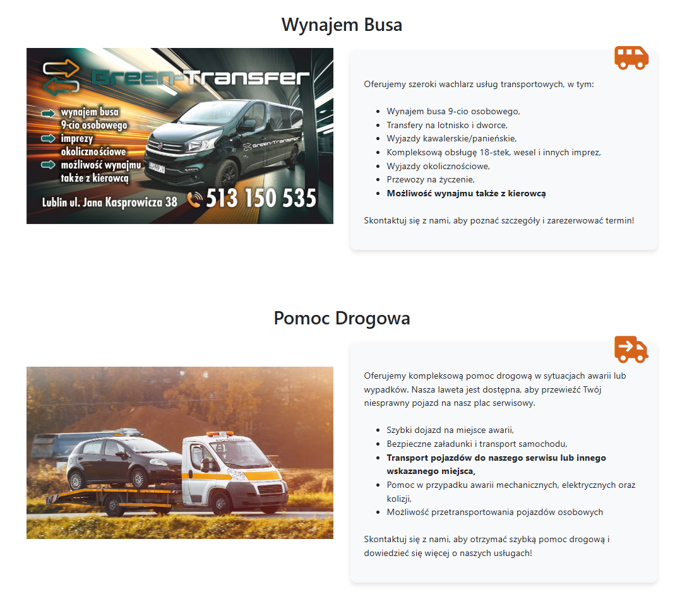
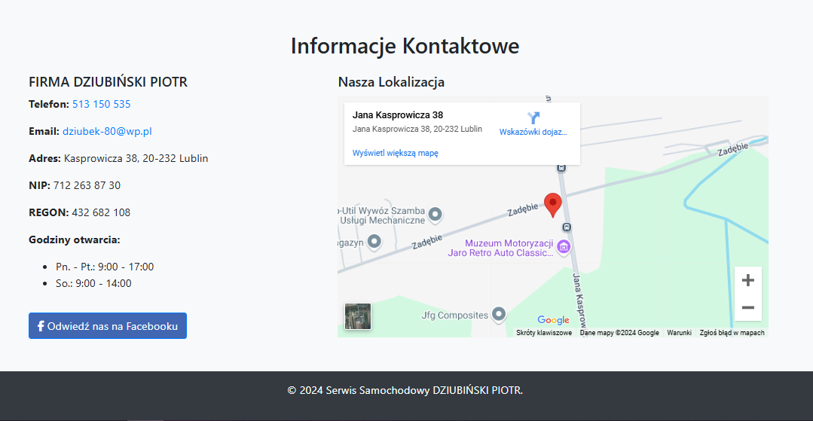

# Serwis Samochodowy DZIUBIŃSKI PIOTR - Strona Internetowa

## Opis Projektu

Strona internetowa dla lokalnego serwisu samochodowego, zlokalizowanego w Lublinie. Witryna prezentuje kompleksową ofertę usług motoryzacyjnych oraz informacje kontaktowe.

## Funkcjonalności

### Sekcje Strony
- Nawigacja
- Carousel ze slajdami prezentacyjnymi
- O firmie
- Usługi serwisowe
- Wynajem busa
- Pomoc drogowa
- Informacje kontaktowe
- Stopka

### Kluczowe Cechy
- Responsywny design
- Zintegrowane ikony z Font Awesome
- Interaktywna mapa Google
- Przycisk kontaktowy
- Link do profilu Facebook
- Pop-up z opcją kontaktu

## Zrzuty Ekranu

### Strona Główna

### Sekcja Usług

### Wynajem Busa

### Kontakt

## Technologie

- HTML5
- CSS3
- Javascript (dla okna pop-up)
- Bootstrap 4.5.2

## Autor

- **Projektant strony**: Paweł Jabłoniec
- **Dla firmy**: Serwis Samochodowy DZIUBIŃSKI PIOTR

## Licencja

Projekt jest prywatną własnością firmy DZIUBIŃSKI PIOTR.

## Uwagi Dodatkowe

- Strona jest w pełni responsywna
- Zoptymalizowana pod kątem SEO
- Zgodna z najnowszymi standardami dostępności
